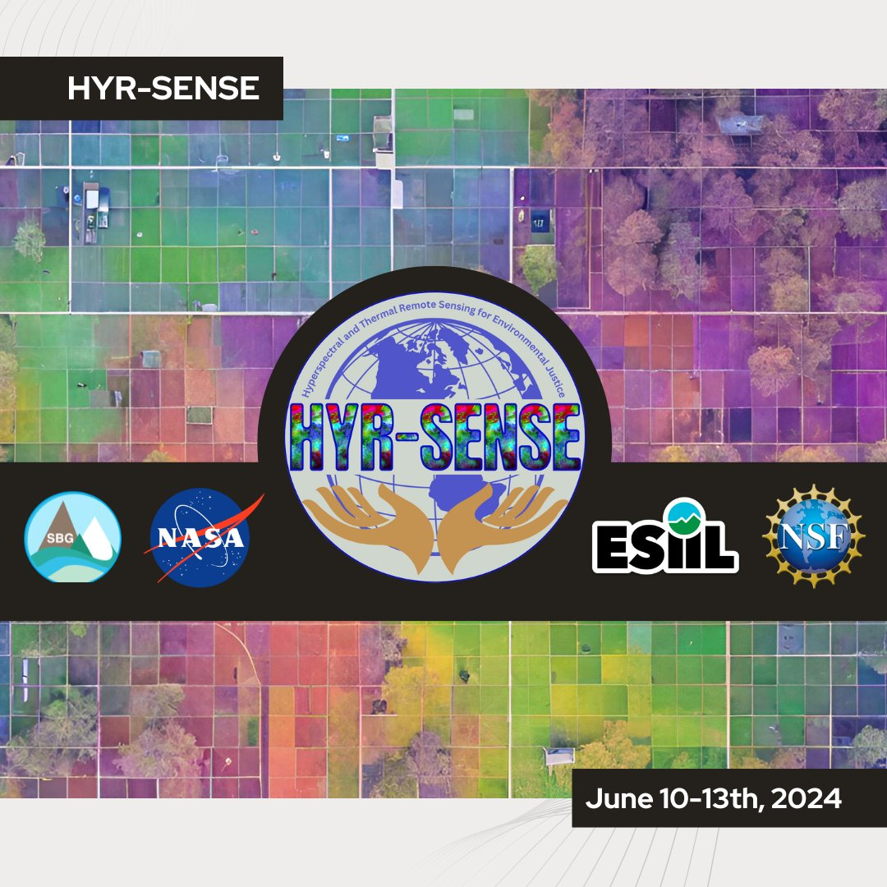

# HYR-SENSE: Hyperspectral and Thermal Remote Sensing for Environmental Justice

NASA-SBG and NSF-ESIIL "HYR-SENSE: Hyperspectral and Thermal Remote Sensing for Environmental Justice" program. This training is funded by the NASA award #8ONSSC24KO328, and is subject to the NSF’s terms and conditions.

## Training details
Join [NASA Surface Biology and Geology](https://sbg.jpl.nasa.gov/) (SBG) and [ESIIL](https://esiil.org/) in Boulder, Colorado this summer for HYR-SENSE: Hyperspectral and Thermal Remote Sensing for Environmental Justice. Participants will gain hands-on experience with hyperspectral and thermal imaging remote sensing technology and its applications for environmental justice issues. 

- Who should apply?: Undergraduate and graduate students, faculty, and early career scientists currently attending or affiliated with a Tribal College or University or affiliates of Native American Tribes. Invited participants will have experience and interests in relevant disciplines, which may include ecology, environmental science, Geographic Information Systems (GIS), remote sensing, natural resource management, or similar.
- When: June 10th-13th, 2024 with additional pre-training sessions
- Where: University of Colorado, Boulder
- Cost: This training is funded by NASA and ESIIL at no cost to the participant. Participants' travel costs, lodging, and meals will be fully covered.
- This program will be tailored to the interests and needs of the participants while being led by experts in the field from NASA and ESIIL.

Click [here](https://esiil.org/hyr-sense) for more details

## Agenda

## Venue Information
HYR-SENSE will be held at the University of Colorado Boulder East Campus SEEC Building (4001 Discovery Dr, Boulder, CO 80303). 

### Explore Boulder Like a Local!
Want to get out to explore while you’re here? [This website](https://www.bouldercoloradousa.com/things-to-do/) has lots of information on things to do in Boulder, such as shopping, restaurants, nightlife, and much more!

### Weather and Packing
Boulder is 5,430 feet in elevation and has a sunny, semi-arid climate. Hydrating during your stay is very important, as altitude sickness (headache, nausea, shortness of breath, dizziness, and tiredness) can occur. Weather conditions can change rapidly throughout each day and from day to day. Layers are always a good choice. In summer months, average high daily temperatures are in the 80s and 90s, with lows in the 50s and 60s. The sun is strong in Boulder, so please bring sunscreen, sunglasses, and a hat. Afternoon thunderstorms aren’t unusual, so a rain jacket is helpful. There are many trails near Boulder, so hiking or running shoes and a set of workout clothes can help get you outside during your stay.

### Health & Safety Resources
* Campus and Off-Campus Emergencies 911
* CU Police Department (On-Campus, Non-Emergency) 303-492-6666
* City of Boulder Police Department (Non-Emergency) 303-441-3333
* Boulder Community Hospital 303-415-7000: 4747 Arapahoe Ave, Boulder, CO 80303

### Technology Needs
We would like you to bring a laptop/notebook that has the ability to connect to the internet (don’t forget your chargers!). If you do not have one that you can bring with you, please email esiil@colorado.edu, as we may be able to request a few rentals from the university library. 

### Internet Access
Access wireless service on campus by selecting UCB Guest Wireless from your available Wi-Fi network options and accepting the terms and conditions upon opening your web browser. You will be prompted to re-accept these terms and conditions periodically. If you encounter difficulty accessing the Internet, call 303-735-HELP (4357) or email help@colorado.edu for assistance during their business hours. Check firewalls or security settings on your computer that could possibly complicate accessing the campus Wi-Fi system before you arrive.

## Hotel Information
Rooms have been reserved for HYR-SENSE participants at [Homewood Suites](https://www.hilton.com/en/hotels/boucohw-homewood-suites-boulder/), located 1 mile from SEEC. The hotel provides a shuttle within a 5 mile radius between 8-4 pm, a daily hot breakfast buffet, and parking. The hotel is just steps from a shopping center with local dining options and a grocery store. 

## Transportation
### Ground Transportation
The HYR-SENSE Team is working on coordinating carpooling to and from the airport for those arriving around the same time. 

**Ride Share**
A Lyft or Uber or airport taxi are the most expensive option but also the most direct way to get from the airport to Boulder (often $70 or higher one way).

**Public transportation to/from airport**
Transit from the Denver airport to Boulder is quite easy via the **AB1 Boulder/Denver** airport bus. This bus runs at least once an hour during the day, with more frequent trips at popular times. To locate the bus, follow signs in the Denver airport baggage claim area to ‘Train to city,’ which will lead you down an escalator. At the base of the escalator, instead of continuing straight towards the visible train station, turn left and you should see a bus terminal with an RTD ticket machine. Tickets for the AB1 can be purchased for $10. Find the gate for the AB1 / Downtown Boulder line.

### Transportation around the Boulder area
Boulder has a number of public transportation options for traversing Boulder and the surrounding area.
**Bus lines**
[Information about Boulder’s local bus network can be found here](http://www.bouldercolorado.gov/goboulder/bus). Note that the Skip, Bound, and Hop lines pass campus regularly.
If you need to travel to Denver for any reason, the [Flatiron Flyer](https://www.rtd-denver.com/services/flatiron-flyer) bus connects Denver to Boulder. Currently the FF1 is the best option, and connects Denver’s Union Station to the Downtown Boulder Station (with numerous stops in-between).

**Biking & Walking**
Boulder has an extensive system of city walking/biking paths; [maps can be found here](https://bouldercolorado.gov/services/multi-use-paths). [Boulder B-Cycle](https://boulder.bcycle.com/nav/start-riding) is a community non-profit bike sharing system with daily and month passes available.
