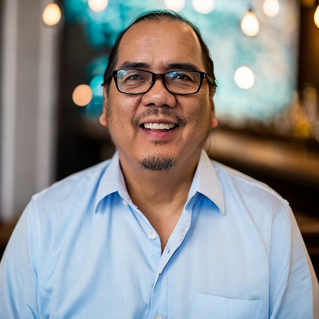
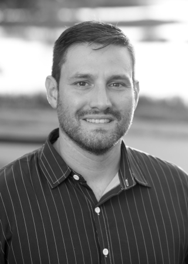
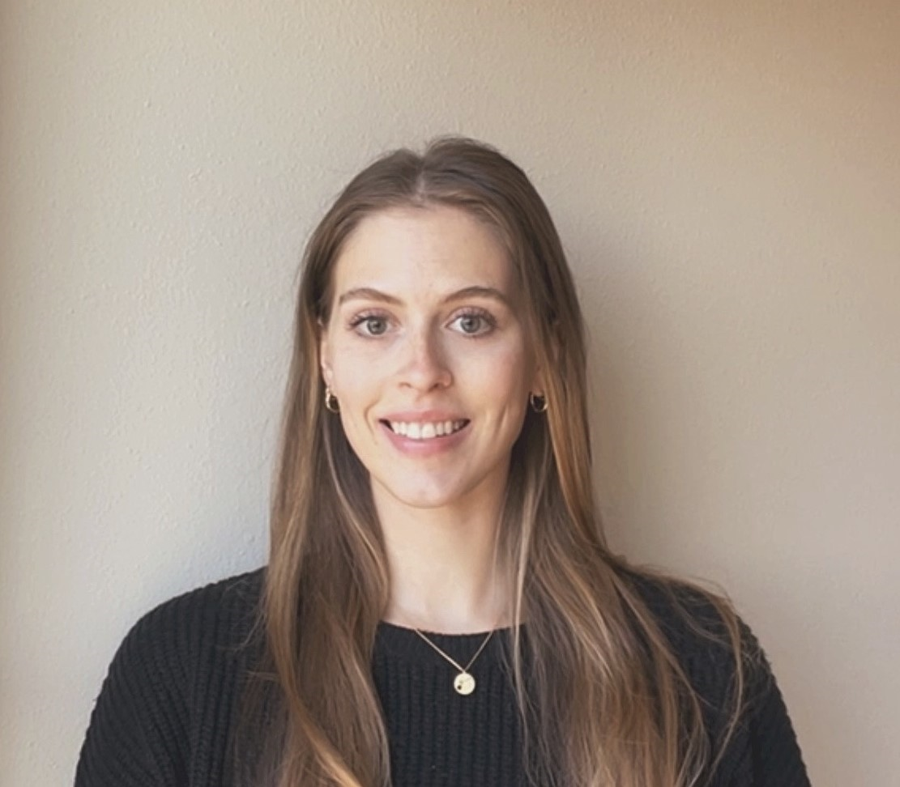
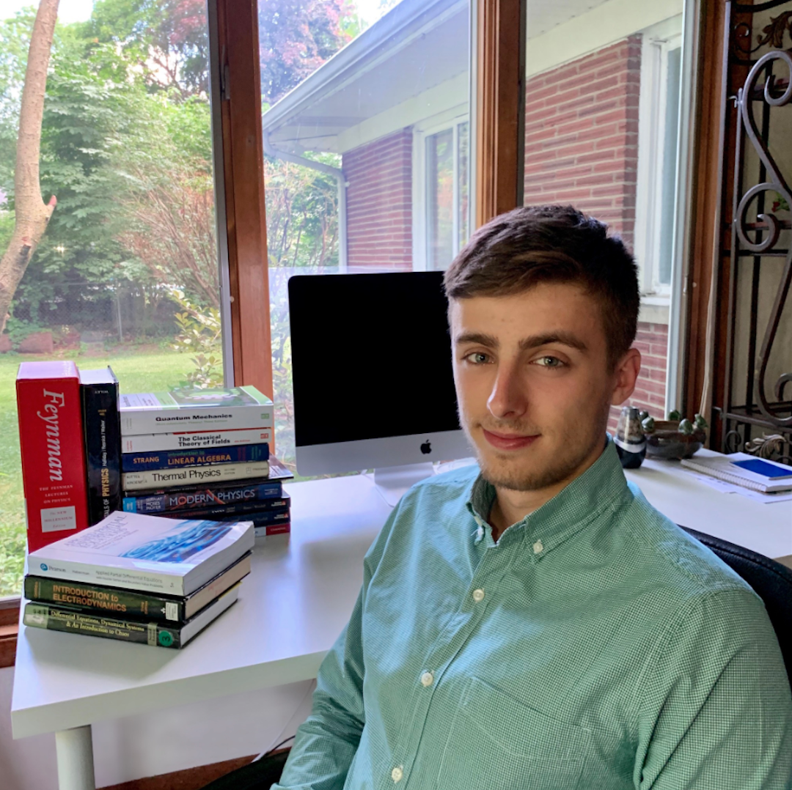
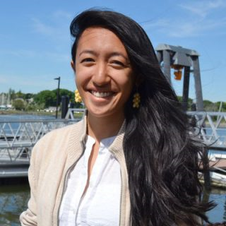
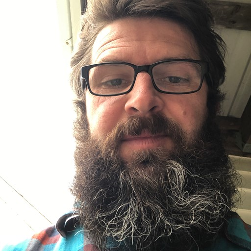
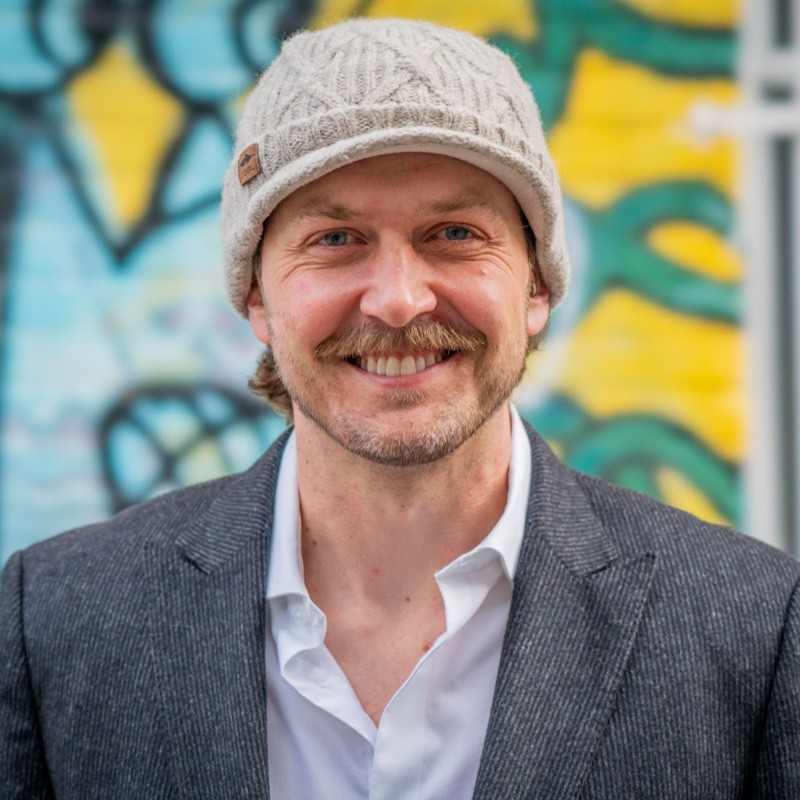

|  &nbsp;&nbsp;&nbsp;&nbsp;&nbsp;&nbsp;&nbsp;&nbsp;&nbsp;&nbsp;&nbsp;&nbsp;&nbsp;&nbsp;&nbsp;&nbsp;&nbsp;&nbsp;&nbsp;&nbsp;&nbsp;&nbsp;&nbsp;&nbsp;&nbsp;&nbsp;&nbsp;&nbsp;&nbsp;&nbsp;&nbsp;&nbsp;&nbsp;&nbsp;&nbsp;&nbsp;&nbsp;&nbsp;&nbsp;&nbsp;&nbsp;&nbsp;&nbsp;&nbsp;&nbsp;&nbsp;&nbsp;&nbsp;&nbsp;&nbsp;&nbsp;&nbsp;&nbsp;&nbsp;&nbsp;&nbsp;&nbsp;&nbsp;&nbsp;&nbsp;&nbsp;&nbsp;&nbsp;&nbsp;&nbsp;&nbsp;&nbsp;&nbsp;&nbsp;&nbsp;&nbsp;&nbsp;&nbsp;&nbsp;&nbsp;&nbsp;&nbsp;&nbsp;&nbsp;&nbsp;&nbsp;&nbsp;&nbsp;&nbsp;&nbsp;&nbsp;&nbsp;&nbsp; | **Ayia Lindquist** I am from Saint Croix in the US Virgin Island and raised in Annapolis, MD. I am leading HYR-SENSE from the NASA side, integrating my background in equity and justice work to ensure the course is supportive of indigenous and environmental justice goals. I am really looking forward to making new connections and building this HYR-SENSE community. In my free time you can find me outside, in the soil or the water. |
| :---: | :--- |

|  &nbsp;&nbsp;&nbsp;&nbsp;&nbsp;&nbsp;&nbsp;&nbsp;&nbsp;&nbsp;&nbsp;&nbsp;&nbsp;&nbsp;&nbsp;&nbsp;&nbsp;&nbsp;&nbsp;&nbsp; | **Rachel Lieber** I am the Community Engagement Specialist for the Environmental Data Science Innovation and Inclusion Lab (ESSIL) and am excited to support the HYR-SENSE program. I am a former K-12 educator and have worked with various research teams examining topics such as reading comprehension, AI for student collaboration, and now environmental data science. I enjoy facilitating the connections between people, whether community members, researchers, teachers, or students so we can all continue to learn from one another. When I'm not working, you may find me at a yoga class, taking a walk, or spending time with my cats (Zelda, Hazel, and Henry). |
| :---: | :--- |

|  &nbsp;&nbsp;&nbsp;&nbsp;&nbsp;&nbsp;&nbsp;&nbsp;&nbsp;&nbsp;&nbsp;&nbsp;&nbsp;&nbsp;&nbsp;&nbsp;&nbsp;&nbsp;&nbsp;&nbsp;&nbsp;&nbsp;&nbsp;&nbsp;&nbsp;&nbsp;&nbsp;&nbsp;&nbsp;&nbsp;&nbsp;&nbsp;&nbsp;&nbsp;&nbsp;&nbsp;&nbsp;&nbsp;&nbsp;&nbsp;&nbsp;&nbsp;&nbsp;&nbsp;&nbsp;&nbsp;&nbsp;&nbsp;&nbsp;&nbsp;&nbsp;&nbsp;&nbsp;&nbsp;&nbsp;&nbsp;&nbsp;&nbsp;&nbsp;&nbsp;&nbsp;&nbsp;&nbsp;&nbsp;&nbsp;&nbsp;&nbsp;&nbsp;&nbsp;&nbsp;&nbsp;&nbsp;&nbsp;&nbsp;&nbsp;&nbsp;&nbsp;&nbsp;&nbsp;&nbsp; | **Jim Sanovia** Háu Jim emačiyab. Hello, my name is Jim. Sičáŋǧu Lakóta etáŋhaŋ wauwé yeló. I come from the Burnt Thigh or Rosebud people. One of the seven bands/tribes of the Lakóta Oyáte. I was raised in HeSapa or the Black Hills of South Dakota. I am ESIIL’s Tribal Resilience Data Scientist. My interests are remote sensing, geospatial applications, data sovereignty, and working with all Tribes and TCUs bringing EDS to their communities. In my spare time I enjoy collecting rocks/minerals and making leather regalia such as quivers, sheaths, backpacks, pouches, etc. |
| :---: | :--- |

|  | **Cibele Amaral** I was born and raised in São Paulo, Brazil. Currently, I am serving as the Interim ESIIL Analytics Director. I oversee the HYR-SENSE program and the associated ESIIL team efforts. My research aims to understand ecological processes across scales and support nature conservation and human well-being using advanced remote sensing technologies. I am also interested in developing open-source tools and cyberinfrastructure solutions to serve different communities’ needs. When I am not working, I enjoy running, hiking with my family, and preparing (and eating) colorful meals.|
| :---: | :--- |

|  | **Ben Poulter** Ben is a research scientist in the Earth Sciences Division at the NASA Goddard Space Flight Center. His research team uses dynamic global vegetation models to explore climate and land-use impacts on the global carbon cycle. Ben co-lead the science and applications team for the NASA Surface Biology and Geology mission, developing and implementing model workflows to quantify uncertainty in reflectance retrievals, algorithms and propagation to carbon and hydrologic processes. He is looking forward to introducing students to tools that provide access to remote sensing data to solve pressing ecological questions. He’s currently hooked on Merlin and documenting bird sightings in ebird. |
| :---: | :--- |

|  &nbsp;&nbsp;&nbsp;&nbsp;&nbsp;&nbsp;&nbsp;&nbsp;&nbsp;&nbsp;&nbsp;&nbsp;&nbsp;&nbsp;&nbsp;&nbsp;&nbsp;&nbsp;&nbsp;&nbsp; | **Aaron Friesz** I am the Science Coordination Lead for NASA’s Land Processes Distributed Active Archive Center (LP DAAC) at the USGS Earth Resource Observation and Science (EROS) Center in Sioux Falls, SD. My background is in ecology, GIS, and remote sensing. At the LP DAAC I provide insights into user needs through user community engagement and outreach activities, and technical support for data archiving, data distribution, and service development. Outside of work you’ll find me at dance competitions – for my two daughters, not me 😉 – or upkeeping my landscaping at our home in Fort Myers, FL – it’s impossible to keep up with. |
| :---: | :--- |

|  &nbsp;&nbsp;&nbsp;&nbsp;&nbsp;&nbsp;&nbsp;&nbsp;&nbsp;&nbsp;&nbsp;&nbsp;&nbsp;&nbsp;&nbsp;&nbsp;&nbsp;&nbsp;&nbsp;&nbsp; | **Bridget Hass** Data Scientist - National Ecological Observatory Network. Bridget is a remote sensing data scientist and data skills educator at NEON, working jointly on the Airborne Observation Platform and Data Skills teams. She is originally from Corvallis, Oregon (the Willamette Valley). Growing up in the Pacific Northwest instilled a love of nature - forests, oceans, and mountains, which she’s carried with her into her career. Before working at NEON and with airborne data, Bridget worked in marine geophysics, supporting oceanographic research projects such as seafloor mapping expeditions. Outside of work, Bridget enjoys getting outside for biking, hiking, and camping, and she also enjoys card games, reading, friends, and her cat Milou. |
| :---: | :--- |

|  &nbsp;&nbsp;&nbsp;&nbsp;&nbsp;&nbsp;&nbsp;&nbsp;&nbsp;&nbsp;&nbsp;&nbsp;&nbsp;&nbsp;&nbsp;&nbsp;&nbsp;&nbsp;&nbsp;&nbsp;&nbsp;&nbsp;&nbsp;&nbsp;&nbsp;&nbsp;&nbsp;&nbsp;&nbsp;&nbsp;&nbsp;&nbsp;&nbsp;&nbsp;&nbsp;&nbsp;&nbsp;&nbsp;&nbsp;&nbsp;&nbsp;&nbsp;&nbsp;&nbsp;&nbsp;&nbsp;&nbsp;&nbsp;&nbsp;&nbsp;&nbsp;&nbsp;&nbsp;&nbsp;&nbsp;&nbsp;&nbsp;&nbsp;&nbsp;&nbsp;&nbsp;&nbsp;&nbsp;&nbsp;&nbsp;&nbsp;&nbsp;&nbsp;&nbsp;&nbsp;&nbsp;&nbsp;&nbsp;&nbsp;&nbsp;&nbsp;&nbsp;&nbsp;&nbsp;&nbsp;&nbsp;&nbsp;&nbsp;&nbsp;&nbsp;&nbsp;&nbsp;&nbsp;&nbsp;&nbsp;&nbsp;&nbsp;&nbsp;&nbsp;&nbsp;&nbsp;&nbsp;&nbsp;&nbsp;&nbsp; | **Casey Jenson** I’m the Program assistant for ESIIL and am coordinating logistics for the HYR-SENSE program. My background is in Environmental Science and Graphic Design and I enjoy combining the two with science communication. I am from the lakes region of Minnesota where I gained my love for being at the lake.  Find me all summer baking, hiking, and spending time with friends on the water. |
| :---: | :--- |

|  &nbsp;&nbsp;&nbsp;&nbsp;&nbsp;&nbsp;&nbsp;&nbsp;&nbsp;&nbsp;&nbsp;&nbsp;&nbsp;&nbsp;&nbsp;&nbsp;&nbsp;&nbsp;&nbsp;&nbsp; | **Erick Verleye** Erick Verleye is a software developer at ESIIL who works on cyberinfrastructure used to facilitate collaborative science. He studied physics at Michigan State University and started his career as a software developer for NASA’s IXPE mission.  He is most looking forward to seeing participants easily collaborate and learn new skills at HYR-SENSE. In his free time, Erick enjoys golfing, working on his car, and programming. |
| :---: | :--- |

|  | **Jesse Barber** Jesse Barber obtained his BS in Physics from Virginia Tech in 2018; During which he assisted in many of the physics research labs on campus, fostering his interest in optical physics and engineering. Two years later he graduated with a Masters in Physics from the University At Buffalo, pursuing experimental optics throughout his graduate education. In the Fall of 2020, He found a career with Science Systems and Applications Inc (SSAI) working at the NASA Goddard Space Flight Center as an Optical Calibration Engineer in their Biospheric Science Laboratory. Jesse runs the Field Calibration Laboratory and specializes in the operation and calibration of radiometric non-imaging spectrometers. |
| :---: | :--- |

|  | **Katya Jay** I am a postdoctoral research associate at ESIIL with a background in ecosystem ecology and integrating ecosystem modeling tools with ground observations to understand vegetation responses to global change. At ESIIL, I’m currently investigating woody expansion into herbaceous alpine tundra ecosystems and I’m excited to be learning new remote sensing tools to incorporate into my research. I grew up in the Pacific Northwest (outside of Portland, Oregon), where my love of nature and mountains inspired me to pursue a career in ecology. Outside of work, I love exploring the Colorado mountains via foot, bike, and skis, as well as going camping with friends. |
| :---: | :--- |

|  &nbsp;&nbsp;&nbsp;&nbsp;&nbsp;&nbsp;&nbsp;&nbsp;&nbsp;&nbsp;&nbsp;&nbsp;&nbsp;&nbsp;&nbsp;&nbsp;&nbsp;&nbsp;&nbsp;&nbsp;&nbsp;&nbsp;&nbsp;&nbsp;&nbsp;&nbsp;&nbsp;&nbsp;&nbsp;&nbsp;&nbsp;&nbsp;&nbsp;&nbsp;&nbsp;&nbsp;&nbsp;&nbsp;&nbsp;&nbsp;&nbsp;&nbsp;&nbsp;&nbsp;&nbsp;&nbsp;&nbsp;&nbsp;&nbsp;&nbsp;&nbsp;&nbsp;&nbsp;&nbsp;&nbsp;&nbsp;&nbsp;&nbsp;&nbsp;&nbsp;&nbsp;&nbsp;&nbsp;&nbsp;&nbsp;&nbsp;&nbsp;&nbsp;&nbsp;&nbsp;&nbsp;&nbsp;&nbsp;&nbsp;&nbsp;&nbsp;&nbsp;&nbsp;&nbsp;&nbsp; | **Kelly Luis** I was born and raised on Maui, Hawai’i. I’m a kanaka maoli scientist at NASA’s Jet Propulsion Laboratory, and serve as EMIT’s Aquatic Applications lead, SBG’s VSWIR aquatic coordinator and Collaborations co-lead. I regularly think about how similar earth observations by my ancestors and remote sensing technologies are. My passion rests in finding creative and equitable approaches for the co-production of environmental knowledge. When I’m not working, you can find me snuggling with cats (Bumper and Pepper) or working in my garden. |
| :---: | :--- |

|  | **Mahsa Jami** Mahsa is a data scientist working at NASA’s Land Processed Distributed Active Archive Center (LP DAAC) at the USGS Earth Resources Observation and Science (EROS) Center in Sioux Falls, SD. She joined LP DAAC in early 2020 and has been supporting LP DAAC missions and data users directly and through creation of tutorials and other learning materials. She also supports and contributes to NASA’s Application for Extracting and Exploring Analysis-Ready Samples (AppEEARS), an application designed to make accessing and subsetting Earth science remote sensing data easy and straightforward. Outside of work, she loves to cook and spend time in nature with her family and friends. |
| :---: | :--- |

|  &nbsp;&nbsp;&nbsp;&nbsp;&nbsp;&nbsp;&nbsp;&nbsp;&nbsp;&nbsp;&nbsp;&nbsp;&nbsp;&nbsp;&nbsp;&nbsp;&nbsp;&nbsp;&nbsp;&nbsp;&nbsp;&nbsp;&nbsp;&nbsp;&nbsp;&nbsp;&nbsp;&nbsp;&nbsp;&nbsp;&nbsp;&nbsp;&nbsp;&nbsp;&nbsp;&nbsp;&nbsp;&nbsp;&nbsp;&nbsp;&nbsp;&nbsp;&nbsp;&nbsp;&nbsp;&nbsp;&nbsp;&nbsp;&nbsp;&nbsp;&nbsp;&nbsp;&nbsp;&nbsp;&nbsp;&nbsp;&nbsp;&nbsp;&nbsp;&nbsp;&nbsp;&nbsp;&nbsp;&nbsp;&nbsp;&nbsp;&nbsp;&nbsp;&nbsp;&nbsp;&nbsp;&nbsp;&nbsp;&nbsp;&nbsp;&nbsp;&nbsp;&nbsp;&nbsp;&nbsp;  | **Nate Quarderer** Education Director; Earth Lab/ESIIL. Nate is an educational researcher currently focused on the topics of data science education, and on how people come to know about climate change and why they hold a particular set of beliefs. At Earth Lab and ESIIL, Nate helped organize and implement the Earth Data Science Corps and ESIIL Stars programs, leading assessment and evaluation efforts. He also helps oversee the Earth Data Analytics--Foundations Online Professional Graduate Certificate. When he’s not working with students, Nate likes to get outside with this dog, Bruce. |
| :---: | :--- |

|  | **Nayani Ilangakoon** Nayani is a research scientist at Earth Lab, University of Colorado Boulder specialized in remote sensing (lidar) and remote sensing applications for forest carbon and ecosystem transformation monitoring. Growing up in Sri Lanka, a tropical island in the Indian Ocean and now living in Colorado with evergreen forests, mountains, and snow, she brings her knowledge about diverse ecosystems and their responses to various changes including climate warming with the use of eyes in the sky (Spaceborne remote sensing). Outside of work, she loves experimenting with new cuisine from around the world. |
| :---: | :--- |

|  | **Shawn Serbin** I grew up in Monroe Michigan, a small-ish town not far from the Ohio border, and still have family in Michigan and across the upper Midwest that we regularly visit. In the fall of 2023 I started my new role as an Earth Scientist at NASA Goddard where I focus on using ground measurements, remote sensing technologies and computer models to understand the role of the land surface and vegetation on terrestrial carbon, water, and energy cycling and connections with the atmosphere. I am looking forward to the course and the opportunity to work with students to demonstrate how the tools and remote sensing data can bring new perspectives and insights into the Earth system. When I am not traveling for work or analyzing data I enjoy kayaking, skiing, hiking or really any outdoor activity, including teaching our young son Elliott how to enjoy and respect nature. |
| :---: | :--- |

|  | **Ty Tuff** Ty is the Friendly Neighborhood Data Scientist at the Environmental Data Innovation and Inclusion Lab (ESIIL) besed at the University of Colorado at Boulder.  |
| :---: | :--- |

