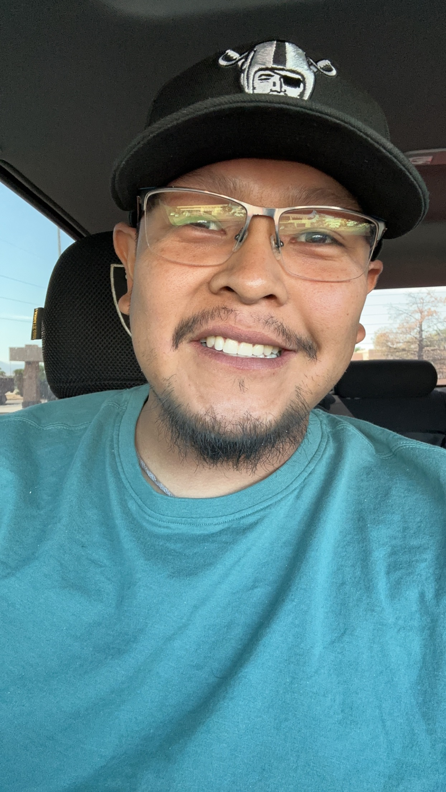
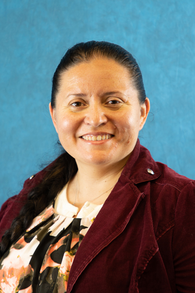
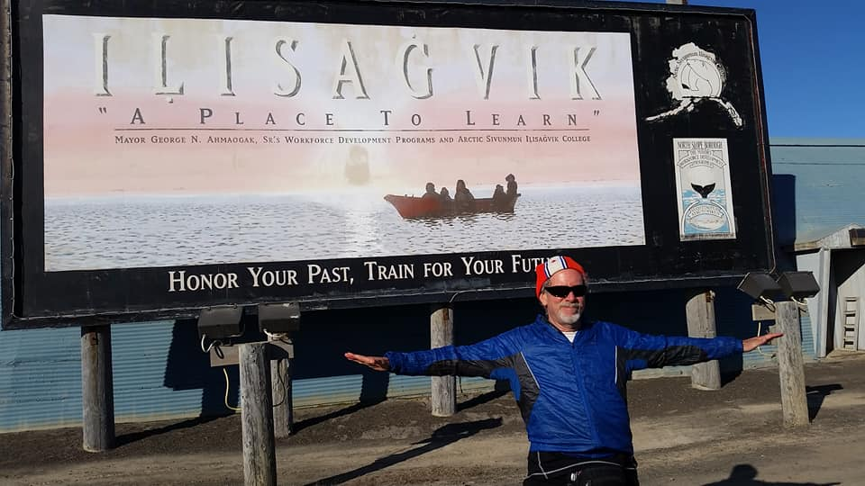
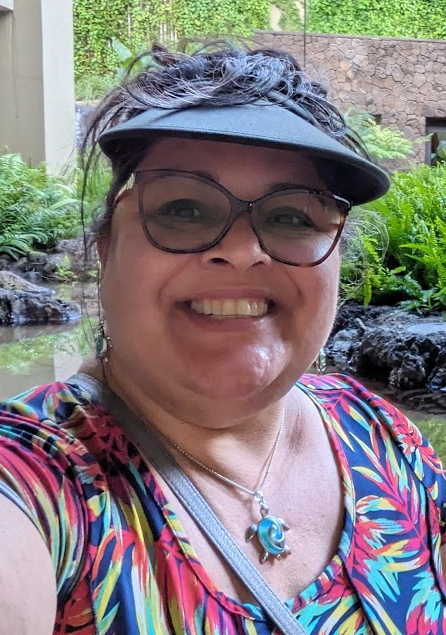

**Check out some of our HYR-SENSE participants!**

|  &nbsp;&nbsp;&nbsp;&nbsp;&nbsp;&nbsp;&nbsp;&nbsp;| **Alex Armendariz** Alex "Panda" Armendariz (Mescalero Apache descendant) is an Indigenous scholar and professional that serves the Southern California Indigenous community in multiple capacities. He currently serves as the Admissions & Outreach Specialized Recruiter in the Office of Admissions & Student Recruitment at California State University, San Bernardino. Panda is also a graduate student in the M.S. Regenerative Studies program at California State Polytechnic University, Pomona. In addition to his roles in higher education, he is involved in the American Indian Science and Engineering Society and serves as the President for the AISES California Professional chapter. His current research and passion revolved on land stewardship and Indigenous Food Systems.|
| :---: | :--- |

|  | **Byron Andrew** I am from the Pueblo of Jemez in New Mexico, born and raised. One of the Nineteen Pueblos in New Mexico. I am the GIS Manager for the Natural Resources Department for the Pueblo of Jemez. My interests are in data sovereignty and indigenous mapping for my tribe, explaining history through maps. I hoping to network and gain more knowledge on computer programming. On my spare time I enjoy hunting, running, and learning to play golf.|
| :---: | :--- |

|  | **Cody O'Dale** Hi my name is Cody O’Dale from Teec Nos Pos, Arizona. I work for the Shoshone-Bannock Tribes: Environmental Waste Management Program as an Environmental GIS Specialist. My day to day is hazardous waste assessment and remediation (If possible). My hobbies include outdoor activities and console gaming. I hope to gain a better understanding of hyperspectral and thermal data while creating a network of people to collaborate with on tribal data at HYR-SENSE.|
| :---: | :--- |

|  &nbsp;&nbsp;&nbsp;&nbsp;&nbsp;&nbsp;&nbsp;&nbsp;&nbsp;&nbsp;&nbsp;&nbsp;&nbsp;&nbsp;&nbsp;&nbsp;&nbsp;&nbsp;&nbsp;&nbsp;&nbsp;&nbsp;&nbsp;&nbsp;&nbsp;&nbsp;&nbsp;&nbsp;&nbsp;&nbsp;&nbsp;&nbsp;&nbsp;&nbsp;&nbsp;&nbsp;&nbsp;&nbsp;&nbsp;&nbsp;&nbsp;&nbsp;&nbsp;&nbsp;&nbsp;&nbsp;&nbsp;&nbsp;&nbsp; | **Cynthia Jacqulin Sanders** Science is a field involving continuous knowledge growth, and I am as interested as the students in learning new information. I attended Northeastern State University and Oklahoma State University. I wish to gain insight on program utilization and data information used by ESILL and apply this information to classroom training and field research data from the Mvskoke reservation for my students.|
| :---: | :--- |

|  &nbsp;&nbsp;&nbsp;&nbsp;&nbsp;&nbsp;&nbsp;&nbsp;&nbsp;&nbsp;&nbsp;&nbsp;&nbsp;&nbsp;&nbsp;&nbsp;&nbsp;&nbsp;&nbsp;&nbsp;&nbsp;&nbsp;&nbsp;&nbsp;&nbsp;&nbsp;&nbsp;&nbsp;&nbsp; | **Eva Weddell** JHaŋ mitakiyapi, Aŋpetu kin de wašte. Eva Weddell emačiyapi. Na Weddell tiošpaye he matanhan. Inawaye kin Monica Weddell eciyapi na Unciwaye kiŋ Winona Sully eciyapi. Ihanktunwan Damakota. Mni luzaȟan ed wati. Tibsapenna heciya taŋhaŋ wahi. Pidamayaye. Hello relatives, today is a good day. My name is Eva Weddell. I am from the Weddell family. My mom’s name is Monica Weddell and my grandma’s name is Winona Sully. I am Ihanktunwan Dakota from the Yankton Sioux Tribe. I live in Rapid City, SD. I am from Wagner, SD. I am a conservation biologist that's interested in using EDS to create solutions and highlight issues in my community.|
| :---: | :--- |

|  | **Justina White Eyes** My name is Justina White Eyes. I was born and raised on my reservation, The Cheyenne River Reservation I am an enrolled member of the Cheyenne River Sioux Tribe. I currently work as an IT Assistant but my passion is Data Science. I graduated from Oglala Lakota College with my BS in Information Technology and I'm currently at Dakota State University for my Masters in Computer Science. I would like to learn more about remote sensing and gain hands on experience.|
| :---: | :--- |

|  &nbsp;&nbsp;&nbsp;&nbsp;&nbsp;&nbsp;&nbsp;&nbsp;&nbsp;&nbsp;&nbsp;&nbsp;&nbsp;&nbsp;&nbsp;&nbsp;&nbsp;&nbsp;&nbsp;&nbsp;&nbsp;&nbsp;&nbsp;&nbsp;&nbsp;&nbsp;&nbsp;&nbsp;&nbsp;&nbsp;&nbsp;&nbsp;&nbsp;&nbsp;&nbsp;&nbsp;&nbsp;&nbsp;&nbsp;&nbsp;&nbsp;&nbsp;&nbsp;&nbsp;&nbsp;&nbsp;&nbsp;&nbsp;&nbsp;&nbsp;&nbsp;&nbsp;&nbsp;&nbsp;&nbsp;&nbsp;&nbsp;&nbsp;&nbsp;&nbsp;&nbsp;&nbsp;&nbsp;&nbsp;&nbsp;&nbsp;&nbsp;&nbsp;&nbsp;&nbsp;&nbsp;&nbsp;&nbsp;&nbsp;&nbsp;&nbsp;&nbsp;&nbsp;&nbsp;&nbsp;&nbsp;&nbsp;&nbsp; | **Robert M Rabin** Studied at McGill University in Montreal. Research meteorologist for 44 years at the National Severe Storms Lab in Norman OK. Developed weather satellite applications at the Space Science and Engineering Center at the University of Wisconsin-Madison. Adjunct faculty member in Environmental Science at the Keweenaw Bay Ojibwa Community College in L’anse MI, and an adjunct instructor at Ilisaġvik College, Utqiaġvik, AK. I have been fascinated in observing the weather since an early age when he grew up near Lake Michigan. Research interests include satellite observations in weather forecasting and effects of land use on climate. I have been learning the Iñupiaq language in the Iñupiaq Studies Program at Ilisaġvik College.|
| :---: | :--- |

|  &nbsp;&nbsp;&nbsp;&nbsp;&nbsp;&nbsp;&nbsp;&nbsp;&nbsp;&nbsp;&nbsp;&nbsp;&nbsp;&nbsp;&nbsp;&nbsp;&nbsp;&nbsp;&nbsp;&nbsp;&nbsp;&nbsp;&nbsp;&nbsp;&nbsp;&nbsp;&nbsp;&nbsp; | **Sam Toledo** Hello, my name is Samantha Toledo. I am from Fort Defiance, Arizona which is located on the Navajo Nation. I am a Wildlife Technician working with the Navajo Nation Fish & Wildlife. I help preserve flora and fauna habitat on the reservation by reviewing a proposed homesite's potential to impact the habitat. Favorite part is interacting with coworkers with similar interest in wildlife preservation. I am currently attending Tohono O'odham Community College studying Geographic Information Systems. I received an associate degree as a Veterinary Technician and soon will be certified within Arizona. I have studied at Arizona State University in Earth & Space Exploration and have one more semester to complete a bachelor's degree. I am excited to see how collected data from thermal and remote sensing is interpreted. Looking forward to using new programs and learning more about ESIIL. I enjoy playing billiards, bowling, and solving puzzles.|
| :---: | :--- |

|  &nbsp;&nbsp;&nbsp;&nbsp;&nbsp;&nbsp;&nbsp;&nbsp;&nbsp;&nbsp;&nbsp;&nbsp;&nbsp;&nbsp;&nbsp;&nbsp;&nbsp;&nbsp;&nbsp;&nbsp;&nbsp;&nbsp;&nbsp;&nbsp;&nbsp;&nbsp;&nbsp;&nbsp;&nbsp;&nbsp;&nbsp;&nbsp;&nbsp;&nbsp;&nbsp;&nbsp;&nbsp;&nbsp;&nbsp;&nbsp;&nbsp;&nbsp;&nbsp;&nbsp;&nbsp;&nbsp;&nbsp;&nbsp;&nbsp; | **Shannon Boldt** Hello my name is Shannon Boldt. I am a member of the Lummi Nation in Washington State. Helping my community is what I try to accomplish daily, luckily I get to as a natural resource data manager for two tribes. I am attending the Northwest Indian College, studying Native Environmental Science, currently I am finishing my second year. What I want to learn is what can be done with all this data that is being gathered by NASA and other organizations and how it can help native tribes mitigate the changes to the climate.|
| :---: | :--- |
