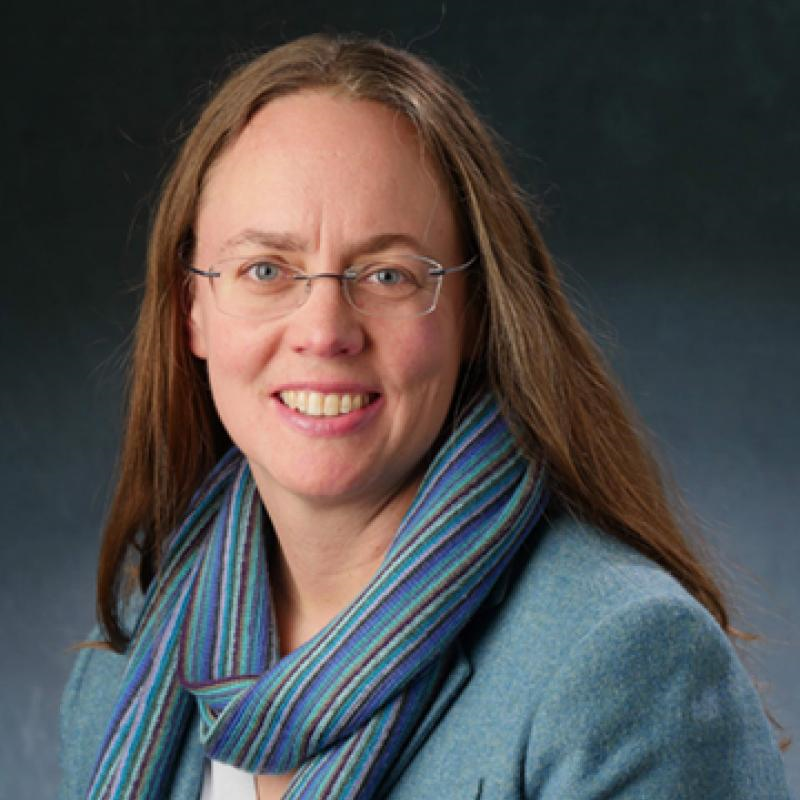
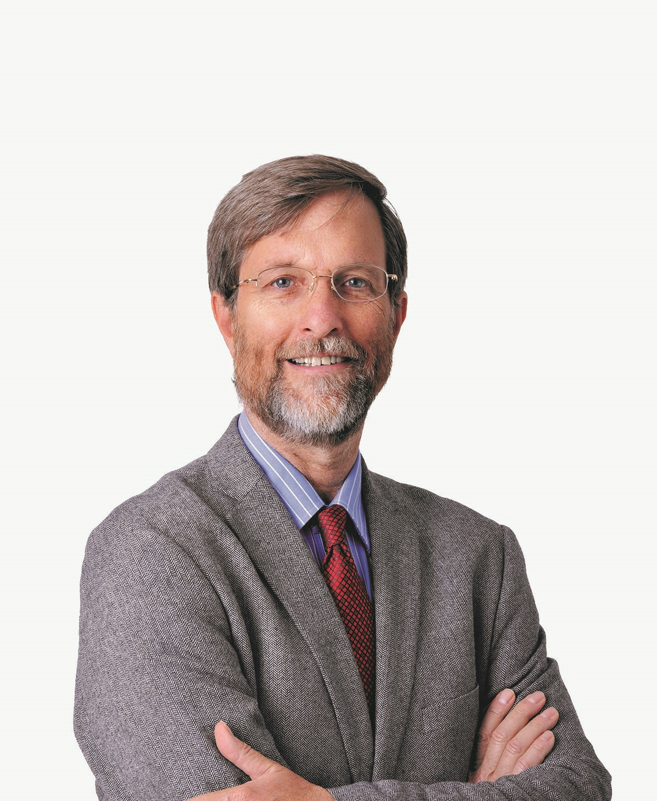
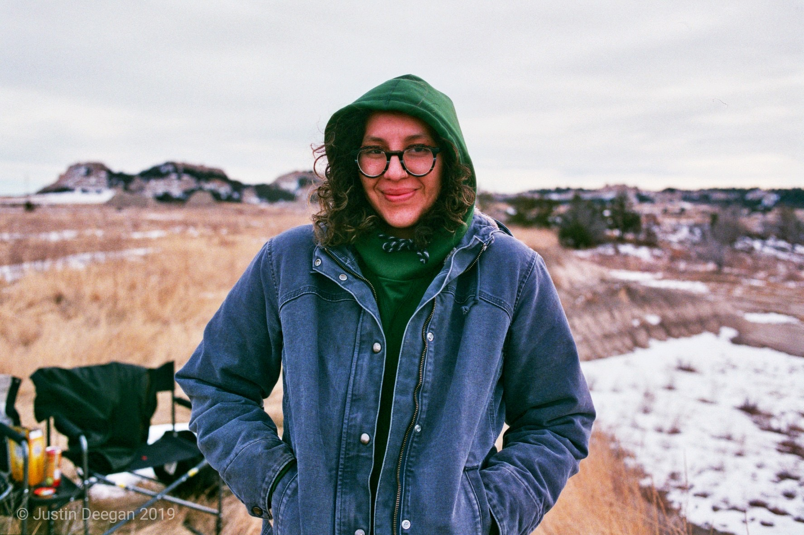
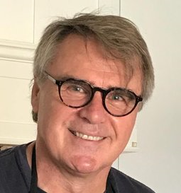

|  &nbsp;&nbsp;&nbsp;&nbsp;&nbsp;&nbsp;&nbsp;&nbsp;&nbsp;&nbsp;&nbsp;&nbsp;&nbsp;&nbsp;&nbsp;&nbsp;&nbsp;&nbsp;&nbsp;&nbsp;&nbsp;&nbsp;&nbsp;&nbsp;&nbsp;&nbsp;&nbsp;&nbsp;&nbsp;&nbsp;&nbsp;&nbsp;&nbsp;&nbsp;&nbsp;&nbsp;&nbsp;&nbsp;&nbsp;&nbsp;&nbsp;&nbsp;&nbsp;&nbsp;&nbsp;&nbsp;&nbsp;&nbsp;&nbsp; | **Jennifer Balch** Jennifer Balch is the Director of ESIIL.  Her research aims to understand the patterns and processes that underlie disturbance and ecosystem recovery, particularly how shifting fire regimes are reconfiguring tropical forests, encouraging non-native grass invasion, and affecting the global climate. Dr. Balch's research aims to explore global patterns of anthropogenic climate and land cover disruptions to help inform people about opportunities to curb and adapt to these changes. |
| :---: | :--- |

|  &nbsp;&nbsp;&nbsp;&nbsp;&nbsp;&nbsp;&nbsp;&nbsp;&nbsp;&nbsp;&nbsp;&nbsp;&nbsp;&nbsp;&nbsp;&nbsp;&nbsp;&nbsp;&nbsp;&nbsp;&nbsp;&nbsp;&nbsp;&nbsp;&nbsp;&nbsp;&nbsp;&nbsp;&nbsp;&nbsp;&nbsp;&nbsp;&nbsp;&nbsp;&nbsp;&nbsp;&nbsp;&nbsp;&nbsp;&nbsp;&nbsp;&nbsp;&nbsp; | **Robert Green** Dr. Robert O. Green is the Principal Investigator of the Earth Surface Mineral Dust Source Investigation (EMIT) that in 2018 was selected by NASA to fly on the International Space Station. He is also the Director of the Microdevices Laboratory and a Senior Research Scientist at the Jet Propulsion Laboratory, California Institute of Technology.  For more than 25 years, his research has used advanced imaging spectrometer instrumentation to test hypotheses and pursue science investigations on Earth, Mars, Moon, and through the solar system. Rob Green is excite about answering useful questions with information from imaging spectroscopy. |
| :---: | :--- |

|  &nbsp;&nbsp;&nbsp;&nbsp;&nbsp;&nbsp;&nbsp;&nbsp;&nbsp;&nbsp;&nbsp;&nbsp;&nbsp;&nbsp;&nbsp;&nbsp;| **Augusta Rattling Hawk** Augusta “Gusti” Rattling Hawk is Oglala Lakota from Wambli, SD. They graduated from Dartmouth College in 2019 with a degree in Environmental Studies and is pursuing their Masters in Conservation Ecology. Their work focuses on incorporating Lakota TEK in the environment, climate change, and conservation. Gusti currently works for the Intertribal Buffalo Council as the Climate-Smart Commodities Technical Services Provider.|
| :---: | :--- |

|  &nbsp;&nbsp;&nbsp;&nbsp;&nbsp;&nbsp;&nbsp;&nbsp;&nbsp;&nbsp;&nbsp;&nbsp;&nbsp;&nbsp;&nbsp;&nbsp;&nbsp;&nbsp;&nbsp;&nbsp;&nbsp;&nbsp;&nbsp;&nbsp;&nbsp;&nbsp;&nbsp;&nbsp;&nbsp;&nbsp;&nbsp;&nbsp;&nbsp;&nbsp;&nbsp;&nbsp;&nbsp;&nbsp;&nbsp;&nbsp;&nbsp;&nbsp;&nbsp;&nbsp;&nbsp;&nbsp;&nbsp;&nbsp;&nbsp;&nbsp;&nbsp;&nbsp;&nbsp;&nbsp;&nbsp;&nbsp;&nbsp;&nbsp;&nbsp;&nbsp;&nbsp;&nbsp;&nbsp;&nbsp;&nbsp;&nbsp;&nbsp;&nbsp;&nbsp;&nbsp;&nbsp;&nbsp;&nbsp;&nbsp;&nbsp; | **Simon Hook** Dr. Simon J. Hook is a senior research scientist in the Science Division at the Jet Propulsion Laboratory. His research is focused on improving our understanding of geologic, hydrodynamic and ecologic processes on planets. Simon has served in a variety of Project, Program and Line management positions at JPL. These include the Principal Investigator (PI) for ECOSTRESS, HyTES and MASTER, the ASTER Project Scientist, the Discipline Program Manager for Carbon Cycle and Ecosystems, the Engineering and Science Directorate (ESD) Chief Scientist, the Manager for the Earth Science Section and Manager for the Science Division. He is also the Principal Investigator or co-investigator of several NASA ROSES proposals. |
| :---: | :--- |

|  | **James Rattling Leaf** James Rattling Leaf is a global Indigenous Consultant and Principal of the Wolakota Lab, LLC who serves as a guide and inspiration to organizations to work more effectively with Indigenous Peoples for a more equitable world. He has over 25 years’ working with the US federal government, higher education institutions and non-profits to develop and maintain effective working relationships with American Indian tribes, tribal colleges and universities and tribal communities.|
| :---: | :--- |

|  &nbsp;&nbsp;&nbsp;&nbsp;&nbsp;&nbsp;&nbsp;&nbsp;&nbsp;&nbsp;&nbsp;&nbsp;&nbsp;&nbsp;&nbsp;&nbsp;&nbsp;&nbsp;&nbsp;&nbsp;&nbsp;&nbsp;&nbsp;&nbsp;&nbsp;&nbsp;&nbsp;&nbsp;&nbsp;&nbsp;&nbsp;&nbsp; | **Deborah McGregor** Deborah McGregor, Anishinabe, Associate Professor and Canada Research Chair: Indigenous Environmental Justice. Osgoode Hall Law School and Faculty of Environmental and Urban Change, York University. Professor McGregor’s research has focused on Indigenous knowledge systems in diverse contexts including environmental and water governance, environmental and climate justice, health and Indigenous legal traditions.  Professor McGregor remains actively involved in a variety of Indigenous communities, serving as an advisor and continuing to engage in community-based research and initiatives.  Professor McGregor has been at the forefront of Indigenous environmental and climate justice and Indigenous research theory and practice. Her work has been shared through the IEJ project website https://www.yorku.ca/research/project/iej/ |
| :---: | :--- |

|  &nbsp;&nbsp;&nbsp;&nbsp;&nbsp;&nbsp;&nbsp;&nbsp;&nbsp;&nbsp;&nbsp;&nbsp;&nbsp;&nbsp;&nbsp;&nbsp;&nbsp;&nbsp;&nbsp;&nbsp; | **David Schimel** David Schimel is mission scientist for SBG and a senior research scientist, leading JPL's Carbon Cycle and Ecosystems group. Dave obtained his PhD from Colorado State University working on atmosphere-ecosystem interactions and has worked on climate and ecosystems since. Dave helped establish the Niwot Ridge flux tower and was the first PI for the NEON observatory.|
| :---: | :--- |

